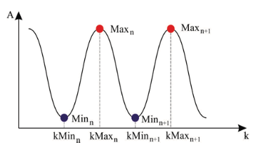

```{r setup, include=FALSE}
knitr::opts_knit$set(root.dir = '~/Documents/magisterska_naloga')
knitr::opts_chunk$set(echo = FALSE, fig.align = "center", fig.pos = "H", message = FALSE, warning = FALSE, results = F, fig.height =3, fig.width = 6.5)

library(ggplot2)
```

Ocenjevanje resnosti Parkinsonove bolezni trenutno temelji na nevroloških pregledih v abulanti, kjer pacient izvaja motorične naloge, ki so opisane v lestvici _Movement Disorder Society-Unified Parkinson's Disease Rating Scale_ (MDS-UPDRS). Ker so pregledi in ocene subjektivni, je raziskovanje objektivnega ocenjevanja pogosto raziskovana tema z različnimi rešitvami.

# Proučevane naloge v dosedanjih študijah

Različna dela preučujejo različne znake Parkinsonove bolezni, vendar med najpogosteje preučevanimi je tapkanje s prsti( _finger tapping_), sledi ji gibanje rok( _hand movements_), pronacija-supinacija ( _pronation-supination_) in tremor. Pogosto so tapkanje s prsti, gibanje rok in pronacija-supinacija preučevane skupaj, ker naj bi bile celoten pokazatelj ocene MDS-UPDRS. 

```{r "delezi preucevanih znakov", fig.cap="Deleži preučevanih znakov Parkinsonove bolezni v pregledanih delih.", fig.height = 2.5, fig.width = 5}
all = 5 + 7 + 8 + 19
preucevana.dela = data.frame(kategorija = c("tremor", "pronacija-supinacija", "gibanje rok", "tapkanje s prsti"),
                             st = c(5/all*100, 7/all*100, 8/all*100, 19/all*100))

library(ggplot2)

ggplot(preucevana.dela, aes(x = st, y = reorder(kategorija, -st))) +
  geom_text(aes(label = paste(round(st, 0), "%")), hjust = -0.05, vjust = 0.5, size = 3) + 
  geom_bar(stat = "identity", fill = "skyblue", color = "skyblue", width = 0.7) +
  scale_x_continuous(limits = c(0, 52.6)) +
  labs(x = " ", y = " ") +
  theme_minimal() +
  theme(plot.margin = margin(1, 1, 1, 2, "cm"))
```


Študije sledijo kliničnim ciljem - stadij bolezni(ocena po MDS-UPDRS), prepoznavanje bolezni v primerjavi z zdravimi kontrolnimi primeri in ocena specifičnih imptomov(oceno tremorja, bradikinezije); največ študij se ukvarja z oceno bolezni po MDS-UPDRS in primerjavo značilk z zdravo kontrolno skupino. Pri ocenjevanju stadija bolezni po MDS-UPDRS gre za kompleksen problem, zlasti med sosednjimi ocenami. Študije poročajo o nizki povprečni natančnosti( _across-task_ in _across-cross-validation-stage accuracy_), vendar o dobri vrednosti sprejemljive natančnosti( _acceptable accuracy_). Pri prepoznavanju bolezni oz. diagnozi bolezni pa poročajo o visokih natančnostih, zlasti pri tapkanju s prsti. \
Ocenjevanje telesnih gibov( _HPE – Human Pose Estimation_) celotnega telesa je doseglo izjemno natančnost, sledenje gibom rok pa zaenkrat še predstavlja izzive. Podobno kot pri ocenjevanju telesnih gibov, tudi pri sledenju rok uporabljajo različne pristope - uporaba nosljivih naprav(IMU, senzorske rokavice) in uporaba računalniškega vida.

# Pridobivanje videoposnetkov oz. podatkov

Objektivno ocenjevanje uporablja nosljive in nenosljive tehnologije za ocenjevanje merjenih značilnosti gibanja. Obstajajo tudi mešani pristopi, pri katerih se uporablja kombinacija računalniških vida in pasivnih ali aktivnih nosljivih naprav. Podatki, zbrani na ta način, se nato analizirajo z modeli, ki ocenjujejo motorične sposobnosti pacienta.  Nosljive naprave predstavljajo uveljavljen pristop za objektivno ocenjevanje stopnje Parkinsonove bolezni in pogosto presegajo tradicionalne pristope računalniškega vida. Večina nosljivih naprav temelji na IMU, ki zaznavajo gibe rok ali na MG senzorjih za merjenje mišične aktivnosti. Tapkanje s prsti( _finger tapping_) ter proučevanje gibov rok pa bolj temelji na analizi video posnetkov in globokem učenju. \ 
Ker je ta način je zelo raziskovana metoda v zadnjih letih, smo se tudi mi osredotočili na pregled del, ki temeljijo na tem pristopu.

Različne študije so se poslužile zajema podatkov na različne načine(npr. tipkanje na tipkovnico, uporaba nosljive naprave nameščene na kazalcu), med najbolj priljubljenimi načini pa so videoposnetki tapkanja s prsti. 

Posnetki so bili pridobljeni v ustreznem okolju(ambulanta ali laboratorij) z uporabo standardnih kamer ali kamer telefonov(15fps, 30fps ali 60fps, večin 1920x1080 slikovnih pik ali 3840x2160 slikovnih pik), ponavadi nameščenih na stojalo, ki je bilo v večini študij 1m oddaljen od roke oz. palca in kazalca.

Pri osebah s Parkinsonovo boleznijo so v večini študij prevladovali moški in bolniki z diagnozo, ki je bila postavljena s strani specialista pred manj kot dvema/tremi/petimi leti(v večini študij) s strani nevrologa. Nekatere študije so obravnavale osebe s Parkinsonovo boleznijo, ki se ne poslužujejo nobeni terapiji, pri nekaterih študijah pa to ni bilo pomembno. Osebe s Parkinsonovo boleznijo so naloge običajno izvajale z obema rokama, pri čemer so se posnetki leve in desne roke obravnavali kot neodvisni, saj je lahko ocena leve in desne strani različna po MDS-UPDRS. Naloga se je izvajala le enkrat, saj pri osebah s Parkinsonovo boleznijo ponovno izvajanje naloge ne prinese realne predstavitve stanja bolezni, zaradi utrujenosti. V nekaterih študijah pa so bili vključeni tudi posnetki zdravih oseb, t.i. kontrolnih oseb, ki niso imeli zgodovine Parkinsonove bolezni ali druge nevrološke bolezni, zaradi specifičnosti obravnavanega problema. Zdrave osebe pa so nalogo izvajale le z dominantno roko. 

Osebam je bilo ponavadi pokazano kako naj izvajajo nalogo, med samim izvajanjem pa jih niso popravljali. Nalogo tapkanja s prsti so v večini izvajali po 10 ali 15 sekund. 

# Obdelava postentkov in podatkov, pridobljenih iz posnetkov

Algoritmi oziroma arhitekture, ki so jih izdelali v študijah vsebujejo različne načine obdelovanja posnetkov. V posnetkih sledijo gibanju rok oz. oceni pozicije roke s pomočjo različnih orodij, obstajajo pa tudi primeri ko so uporabili globoko nevronsko mrežo neposredno na videoposnetkih tapkanja s prsti.

Sledenje gibom rok na podlagi videoposnetkov oz. ocena pozicije rok( _hand pose estimation_) je metoda pridobivanja nabora položajev sklepov rok iz _RGB_, _depth_ in _RGB-Depth_ videposnetkov. Za detekcijo roke večina uporablja nabor sklepov z različnimi orodji. Večina uporablja nabor sklepov, ki se uporablja v orodnjih _OpenPose_ in _MediaPipe_, je model roke COCO( _COCO Hand model_), sestavljen iz 21 točk, ki predstavljajo glavne sklepe roke, kot je prikazano na sliki \@ref{skelet_roke}.

{width=50%}

Torej zazanavanje drže roke oziroma položaj sklepov je večina študij pridobila s pomočjo orodij _MediaPipe_, _OpenPose_, _DeepLabCut_ in _MMPose_, ki so v zadnjih letih najbolj uporabna. Za roko vrnejo skelet 21 točk iz katerih so potem računali različne značilke.

```{r "delezi orodij", fig.cap="Deleži uporabljenih orodij v preučevanih delih za sledenje rok in zaznavanje drže roke iz videoposnetkov. ", fig.height = 2.5, fig.width = 5}
orodja = data.frame(kategorija = c("MMPose", "DeepLabCut", "MediaPipe", "OpenPose", "druga(kombinirana) orodja"),
                             st = c(12, 20, 20, 24, 24))

ggplot(orodja, aes(x = st, y = reorder(kategorija, -st))) +
  geom_text(aes(label = paste(st, "%")), hjust = -0.05, vjust = 0.5, size = 3) + 
  geom_bar(stat = "identity", fill = "skyblue", color = "skyblue", width = 0.7) +
  scale_x_continuous(limits = c(0, 26.7)) +
  labs(x = " ", y = " ") +
  theme_minimal() +
  theme(plot.margin = margin(1, 1, 1, 2, "cm"))
```

Dogajalo se je tudi, da zgornja orodja niso zaznala vseh sličic videoposnetka in so podatki imeli mankajoče točke skeleta posameznih sličic. Nekateri so se problema lotili z linearno interpolacijo, ki so jo uporabili le v primeru, ko je orodje zaznalo prejšnjo in naslednjo sličico. Posnetke, kjer orodja niso zaznala več sličic, so odstranili iz podatkov. 

Identificirali so tudi posamična gibanja tapkanja s prsti - cikel tapkanja. Nekateri so se problema lotili z izračunom razdalje med palcem in kazalcem oz. kotne razdalje med palcem in kazalcem in na podlagi tega ter standardnih algoritmov določili vrh in dno amplitude oz. odpiranje in zapiranje prstov. Večina se jih je posluževalo izračuna evklidske razdalje med palcem in kazalcem, saj so bili koti občutljivi na nagib kamere - med kamero in roko bi moralo biti 90 stopinj. 

Orodja so v podatke vpeljela visokofrekvenčne šume, ki nastanejo zaradi prileganja skeleta orodja roki in tremorja oseb s Parkinsonovo boleznijo. Dobljene razdalje oz. kote so zato zgladili na različne načine.

Nekatere študije so se lotile tudi problema neravnovesja razredov - večina je bila uporabljen tehnika SMOTE( _Synthetic Minority Oversampling Technique_). S to tehniko so povečali manj zastopane razrede in zmanjšali prekomerno zastopane razrede v njihovih podatkih. 

Pred računanjem značilk so nekateri avtorji, predvsem tist, ki se niso posluževali ročnega računanja značilk, podatke normalizirali z uporabo povprečja in standardne deviacije podatkov(Z-score normalization).

# Značilke

Večina avtorjev je svoje modele gradila na ročno izračunanih značilkah( _manual features_) glede na smernice ocen po lestvici MDS-UPDRS. Ker pa nekateri niso dobro poznali problema in značilnosti Parkinsonove bolezni, ali pa so model, naučen na ročno izračunanik značilkah, želeli primerjati, so se izračuna značilk lotili z nevronskimi mrežami. Kot vhodni podatek so podali časovno zaporedje podatkov, model pa je iz njih izluščil značilke. 

## Ročno pridobljene značilke

Ročno računanje značilk je temeljilo na signalih, ki so predstavljali pospešek( _acceleration_), kotna hitrost( _angular velocity_), premik( _displacement_) in kot( _angle_) v časovni vrsti. 

Za izračun sprememb območja in hitrost tapkanja prstov so avtorji po večini izbrali dvodimenzionalne podatke o sklepih, kjer je posamezen sklep $J_i$, $i = 1, \dots, 21$(model roke COCO) je definiran kot $J_i = (x_i, y_i)$ oz. tridimenzionalne podatke o sklepih, torej posamezen sklep $J_i$, $i = 1, \dots, 21$(model roke COCO) je definiran kot $J_i = (x_i, y_i, z_i)$, s katerimi so računali evklidske razdalje med posameznimi sklepi v določenem časovnem okvirju, najpogosteje razdaljo med palcem in kazalcem. Evklidska razdalja med palcem in kazalcem v časovnem okvirju $t$ za dvodimenzionalne podatke je definirana kot

$$
D_t = d(J_4^t, J_8^t) = \sqrt{(x_4^t - x_8^t)^2 + (y_4^t - y_8^t)^2}
$$

oz. za trodimenzionalne podatke

$$
D_t = d(J_4^t, J_8^t) = \sqrt{(x_4^t - x_8^t)^2 + (y_4^t - y_8^t)^2 + (z_4^t - z_8^t)^2}.
$$

{width=50%}

- Število gibanj, štetih po maksimalnih točkah
- Maksimalna točka med maksimalnimi točkami
- Maksimalna točka med minimalnimi točkami
- Minimalna točka med maksimalnimi točkami
- Minimalna točka med minimalnimi točkami
- Povprečno število maksimalnih točk
- Standardni odklon maksimalnih točk
- Povprečno število minimalnih točk
- Standardni odklon minimalnih točk
- število vrhov v časovnem intervalu, $F_p$

### Amplituda( _amplitude_) in hitrost( _velocity_)

Amplituda in hitrost sta dve najbolj običajni značilki, ki se analizirata za oceno Parkinsonove bolezni z uporabo tapkanja s prsti. V večini primerov sta definirani kot:

_Amplituda: razdalja med palcem in kazalcem._\
_Hitrost: razlika v amplitudi skozi čas._

Iz amplitude in hitrosti so bile pogosto izračunane naslednje značilke:

- Povprečna, maksimalna in minimalna hitrost odpiranja in zapiranja, 
- povprečna, maksimalna in minimalna amplituda odpiranja in zapiranja, standardni odklon amplitude odpiranja in zapiranja,
- povprečje in koeficient variacije amplitude gibanja,
- povprečje in koeficient variacije hitrosti gibanja (amplituda gibanja / trajanje gibanja),
- povprečje in koeficient variacije hitrosti gibanja pri odpiranju (amplituda gibanja / trajanje gibanja pri odpiranju), 
- povprečje in koeficient variacije hitrosti gibanja pri zapiranju (amplituda gibanja / trajanje gibanja pri zapiranju), 
- povprečje, koeficient variacije in razpon trajanja cikla, 
- hitrost gibanja (število pritiskov na čas) ter 
- upad amplitude (povprečna amplituda v prvi polovici poskusa v primerjavi s povprečno amplitudo v drugi polovici poskusa).
- prelomna točka amplitude( _breakpoint_), $F_{amp- bp}$
- prelomna točka hitrosti( _breakpoint_), $F_{vel- bp}$

**Definicija:** _Amplituda odpiranja_ je razlika med najvišjo in najnižjo točko v fazi odpiranja gibanja. Izračuna se po formuli

$$
Max_n-Min_n.
$$

**Definicija:** _Amplituda zapiranja_ je razlika med najvišjo in najnižjo točko v fazi zapiranja gibanja. Izračuna se po formuli

$$
Max_n-Min_{n+1}.
$$

**Definicija:** _Hitrost odpiranja_ je razlika med največjim in najmanjšim vrhom v fazi odpiranja gibanja, deljena z ustreznim časovnim intervalom. Izračuna se po formuli

$$
\frac{Max_n-Min_n}{kMax_n-kMin_n}.
$$


**Definicija:** _Hitrost zapiranja_ je razlika med največjim in najmanjšim vrhom v fazi zapiranja gibanja, deljena z ustreznim časovnim intervalom. Izračuna se po formuli

$$
\frac{Max_n-Min_{n+1}}{kMax_n-kMin_{n+1}}.
$$

_Povprečje amplitude_:
$$
F_{amp - mean} = \frac{\sum_{n=1}^{N}A_n}{N},
$$

kjer $p = [p_1, p_2, \dots, p_n, \dots, p_N]$ predstavlja vrhove, kjer je $p_n$ $n$-ti vrh, $A_n$ pa amplituda pripadajočega vrha $p_n$. 

_Varianca amplitude_:
$$
F_{amp - var}\frac{\sum_{n=1}^{N}(A_n - f_{mean})^2}{N}
$$

_Povprečna hitrost gibanja prsta_:
$$
F_{vel - mean} = \frac{\sum_{n=1}^{N-1}V_n}{N-1},
$$

kjer je $V_n = \frac{A_n + A_{n-1}}{\Delta t_n}$, $\Delta t_n = t_n - t_{n-1}$ časovni interval med $n-1$-tim in $n$-tim vrhom amplitude.

_Varianca hitrosti_:
$$
F_{vel - var} = \frac{\sum_{n=1}^{N-1}(V_n - s_{mean})^2}{N-1}.
$$


### Utrujenost oz. zastoj in oklevanje( _halt and hesitation_)
Utrujenost oz. zastoj in oklevanje sta lastnosti pri kateri imamo več različnih pristopov, uporabljenih za njeno oceno. Na primer:

- razlika med najvišjimi in najnižjimi vrednostmi amplitudnih vrhov,
- gradient amplitude glede na čas,
- razlika med številom tapkanj v dveh časovnih intervalih,
- koeficient variacije v hitrosti tapkanja,
- razlika med povprečno vrednostjo maksimalne amplitude tapkanja prstov v dveh časovnih intervalih,
- koeficient variacije v maksimalni amplitudi tapkanja prstov,
- pospešek tapkanja.

Zastoj je bil ponavadi opredeljen kot trenutek popolne ustavitve, oklevanje pa kot opazen upad hitrosti. Ta dva pojma so opredelili s pomočjo vrhov $p = [p_1, p_2, \dots, p_n, \dots, p_N]$, kjer so uporabili model prilagajanja krivulje množici $p$, z namenom ocene trenda vrhov. Predpostavljamo, da je $p_n$ vrh, ko je prišlo do zastoja in oklevanja, $\hat{p}_n$ pa predstavlja napovedani vrh na podlagi prilagojenega modela. Potem je značilka zastoja in oklevanja lahko definirana kot

$$
F_{hh} = \begin{cases}
1, \text{ če } \lvert \hat{p}_n - p_n \lvert \ge \theta \\
0, \text{ če } \lvert \hat{p}_n - p_n \lvert < \theta
\end{cases},
$$

kjer je prag( _threshold_) definiran kot $\theta = \alpha \cdot \frac{A_{n+1}+ A_{n-1}}{2}$, $\alpha$ je parameter, ki nadzoruje prag, ki ga zaznamo( _detection threshold_). 

### Frekvenca( _frequency_) oz. ritem( _rhythm_)

Uporabljata se oba pojma, ampak ne pomenita vedno isto. Izračun lahko temelji na na uporabi hitre Fourierove transformacije( _Fast Fourier Transform_), eden izmed pristopov je tudi uporaba lastnosti "prekrižna korelacija med normaliziranimi vrhovi"( _cross-correlation between the normalized peaks_) za oceno doslednosti in ritma pri tapkanju. 

**Definicija:** Frekvenca je enota, deljena s časovnim razponom enega gibanja. Izračunamo jo po formuli

$$
F_{freq} = \frac{1}{kMax_{n+1} - kMax_{n}}.
$$

Računali so:

- povprečna frekvenca, 
- standardni odklon frekvence. 

## Demografske značilke

Nekateri so v model vklučili tudi dva demografska dejavnika - spol in starost. To temelji na opažanju, da naj bi lahko starejši posamezniki kazali znake bradikinezije, povezane s staranjem, neodvisno od Parkinsonove bolezni, ter da lahko starost in spol vplivata na razvoj bolezni.

## Izbira značilk

Izračunane značilke so ponavadi standardizirali z uporabo metode _StandardScalar_, kar naj bi zagotvaljalo, da vse značilke enako prispevajo k modelu in da ne bi katera izmed značilk prevadovala pri učanju modela ali pa so bile značilke normalizirane s standardno normalno porazdelitvijo(povprečje 0 in standardni odklon 1).

V študijah, kjer so imeli več značilk, so iskali tudi optimalno množico značilk - značilke, ki so najpomemnejše pri klasifikaciji Parkinsonove bolezni. Iskanje optimalne množice značilk se je razlikovalo glede na glavo nalogo zo. cilj študije. Tisti, ki so imeli, poleg nabora podatkov oseb s Parkinsonovo boleznijo, še nabor podatkov zdravih(kontrolnih) oseb, so primerjali značilke, izračunane za obe skupini oseb. Značilke so bile pregledane s pomočjo statističnega testiranja, da se ocenijo porazdelitve v teh dveh skupinah oseb. Ker so značilke pokazale nenormalno porazdelitev s pomočjo Shapiro-Wilkovega testa, so lahko uporabljali Mann-Whitneyev U-test za neodvisne vzorce, za prepoznavanje značilk, ki so v obeh skupinah oseb porazdeljene različno. Uporabljali so značilke, ki so bile, glede na skupino oseb, porazdeljene različno. 

Za izbor množice optimalnih značilk so bili uporabljeni tudi različni algoritmi.\
Pri algoritmu _Speeded Up Robust Features_(SURF) so bile izbrane značilke s pozitivnim rezultatom, ker to pomeni, da je značilka stabilna, točna in potencialno uporabna za nadaljnje operacije.\
Algritem _Reursive Feature Elimination_(RFE) iterativno odstranjuje najmanj pomembne značilke na podlagi uspešnosti modela podpornih vekorjev(SVM), na koncu pa izbere množico, ki najbolje prispeva k nalogi klasifikacije.\
_SelectKBest_ razvršča značilke glede na njihov _k-score_, metriko, ki meri relevantnost in informativnost posamezne značilke glede na ciljno spremenljivko. Značlke, ki imajo najvišje _k-score_, so prednostno vključene v končni nabor značilk, medtem ko so manj informativne značilke izključene.\

Nekateri avtorji so po gradnji modelov na množici izbranih značilk ugotovili, da izključitev določenih značilk in s tem poslabšanje ravnovesja med značilkami povzorči poslabšanje modela, zato so se vselej odločili za gradnjo modela na celotnem naboru značilk. 

# Modeli

Osredotočili smo se na pregled del, kjer so izvajali klasifikacijsko napoved, binarno ali multiklasifikacijsko. Glavni cilj študij je torej bil implementirati model za napovedovanje ocen Parkinskonove bolezni po letstvici MDS-UPDRS. Avtorji so za gradnjo in vrednotenje modelov uporabljali knjižnico _scikit-learn_ za programski jezik Python, ki ponuja orodja za različne naloge strojnega učenja.

## Gradnja modelov

Večina je usposobilo en sam večrazredni klasifikacijski model, kar pomeni, da izhod modela predstavlja vse ocene po lestvici MDS-UPDRS. Nekateri pa so usposobili več binarnih klasifikatorjev. Nekateri delujejo na način, da prvi model razvršča podatke videoposnetkov z oceno 0 v primerjavi z ocenami 1,2 in 3; drugi model razvršča podatke videoposnetkov z ocenama 0 ali 1 v primerjavi z ocenami 2 ali 3; in tretji model razvršča podatke videoposnetkov z ocenami 0, 1 ali 2 v primerjavi z oceno 3. Uporabljen je bil tudi pristop, kjer je prvi model razvrščal zdrave(konotrolne) osebe od oseb s Parkinsonovo boleznijo in če je ta prvi model pokazal, da podatki videoposnetka pripadajo osebi s Parkinsonovo boleznijo, je drugi model razvrstil  ocene 1 proti ocenam 2 ali 3. In če je drugi model pokazal, oceno, višjo od 1, tretji model razvrsti ocene 2 proti ocenam 3.

Gradili so različne modele, med najbolj pogostimi pa so bili metoda podpornih vektorjev(SVM, _Support Vector Machine_) z različnimi jedri( _karnels_), ansambli, kot sto naključni gozdovi(RF, _Random Forest_) in XBoost ter običajni klasifikatorji, kot so odločitvena drevesa( _Decision Tree_), model $k$-najbližjih sosedov( _$k$-nearest neighbors_) in logistična regresija( _logistic regression_). V zadnjih letih pa se uporabljajo tudi globoke nevronske mreže( _deep neural networks_). \
Zaradi razlik v postopkih, podatkovnih zbirkah, nalogah klasifikacije in uporabljenih klasifikatorjih, ne moremo podati vpogleda, kateri način modeliranja je najboljši za klasifikacijo tapkanja s prsti po lestvici MDS-UPDRS, so pa nekateri avtorji v prvi fazi raziskovanja zgradili več modelov in potem, glede na rezultate, podrobno obravnavali le glavna dva ali tri.

```{r "delezi modelov", fig.cap="Deleži uporabljenih modelov v preučevanih delih za sledenje rok in zaznavanje drže roke iz videoposnetkov. Oznake: logistična regresija(LR), kNN(k-najbližjih sosedov), odločitvena drevesa(DT), konvolucijske nevronske mreže(CNN), metoda podpornih vektorjev(SVM), naključni gozdovi(RF).", fig.height = 2.5, fig.width = 5}
LR = 2
kNN = 4
SVM = 6
DT = 4
RF = 8
CNN = 4
XGBoost = 3
LightGBM = 1
GCN = 1
AdaBoost = 1
OF.DDNet = 1
FNN = 1
Drugo = LightGBM + GCN + AdaBoost + OF.DDNet  + FNN

all = LR + kNN + SVM + DT + RF + CNN + XGBoost

modeli = data.frame(kategorija = c("LR", "kNN", "SVM", "DT", "RF", "CNN", "XGBoost"),
                             st = c(LR, kNN, SVM, DT, RF, CNN, XGBoost))
modeli$st = round(modeli$st/all * 100, 1)

ggplot(modeli, aes(x = st, y = reorder(kategorija, -st))) +
  geom_text(aes(label = paste(st, "%")), hjust = -0.05, vjust = 0.5, size = 3) + 
  geom_bar(stat = "identity", fill = "skyblue", color = "skyblue", width = 0.7) +
  scale_x_continuous(limits = c(0, 29)) +
  labs(x = " ", y = " ") +
  theme_minimal() +
  theme(plot.margin = margin(1, 1, 1, 2, "cm"))
```

Pri izbiri hiperparametrov modelov so se posluževali različnih algoritmov, kot sta RandomizeSearchCV in GridSearchCV. Pri iskanju so uporabljali le podatke za učenje, da bi dodatno zagotovili robustnost naučenih klasifikatorjev oz. modelov. Podatki so torej bili razdeljeni na učne in testne, ponavadi v razmerju 70\%/30\% ali  80\%/20\%, modeli pa usposobljeni z uporabo $k$-kratne navzkrižne validacije( _$k$ - Cross Validation_), v večini primerov $k$ = 5, nekje celo $k$ = 10, pri čemer so uporabljeni le podatki iz učne množice podatkov.

## Vrednotenje modelov

Za vrednotenje modelov so standardno uporabljali štiri različne metrike, točnost( _accuracy_), natančnost( _precision_), priklic( _recall_) in F1, ki temeljijo tabela napačnih klasifikacij ( _confusion matrix_). Pogosto je bila primerjava modelov narejena tudi na podlagi ploščine pod krivuljo(AUC, _Area Under Curve_). 


## Rezultati

V spodnjih tabelah so prikazane študije, njihovi avtorji, ter glavne značilnosti študije - uporabljeni podatki, cilj študije, preučevan dejavnik Parkinsonove bolezni in uporabljeni modeli strojnega učenja.

```{r}
avtorji = c("D. L. Guarín, J. K. Wong, N. R. McFarland, A.Ramirez-Zamora", 
            "A. Moshkova, A. Samorodov, N. Voinova, A. Volkov, E. Ivanova, E. Fedotova",
            "Z. LI, I. Kang, M: Cai, X: Liu, Y. Wang, J. Yang",
            "G. Amprimo, I. Rechichi, C. Ferraris, G. Olmo", 
            "S. Srinivasan , P. Ramadass, S. K. Mathivanan, K. P.Selvam, B. D. Shivahare, M. A. Shah",
            "J. Yanga, S. Williams, D. C. Hogg, J. E. Alty, S. D. Relton",
            "G. Morinan, Y. Dushin, G. Sarapata, S. Rupprechter, Y. Peng, C. Girges, M. Salazar, C. Milabo, K. Sibley, T. Foltynie, I. Cociasu, L. Ricciardi, F. Baig, F. Morgante, L. A. Leyland, R. S. Weil, R. Gilron, J. O’Keeffe",
            "G. Vignouda, C. Desjardinsc, Q. Salardainec, M. Monginc, B. Garcinc, L. Venancea, B. Degos",
            "T. Yu, K. W. Park, M. J. McKeown, Z. J. Wang",
            "Z. Guo, W. Zeng, T. Yu, Y. Xu, Y. Xiao, Z. Cao, X. Cao",
            "G. Sarapata , Y. Dushin , G. Morinan , J. Ong , S. Budhdeo, B. Kainz, J. O’Keeffe",
            "M. S. Islam, W. Rahman, A. Abdelkader, S. Lee, P. T. Yang, J. L. Purks, J. L. Adams, R. B. Schneider, E. R. Dorsey, E. Hoque",
            "H. Li, X. Shao, C. Zhangc, X. Qian",
            "M. Lu,  Q. Zhao, K. L. Poston, E. V. Sullivan, A. Pfefferbaum, M. Shahid, M. Katz, L. M. Kouhsari, K. Schulman, A. Milstein, J. C. Niebles, V. W. Henderson")

leto = c(2024, " ", 2022, 2023, 2024, 2024, 2023, 2022, 2023, 2022, 2023, 2023, 2021, 2021)

podatki = c("180 videoposnetkov(44 ZO, 123 PB)", 
            "32 videoposnetkov(16 ZO, 16 PB)",
            "252 videoposnetkov",
            "95 videoposnetkov(60 ZO, 35 PB)",
            "195 glasovnih posnetkov(48 ZO, 147 PB)",
            "152 videoposnetkov(37 ZO, 40 PB)",
            "1156 videoposnetkov(528 ZO, 628 PB)", 
            "272 videoposnetkov",
            "75 videoposnetkov(10 ZO, 65 PB)",
            "112 videoposnetkov(11 ZO, 48 PB)",
            "7310 videoposnetkov",
            "250 videoposnetkov(78 ZO, 172 PB)",
            "744 videoposnetkov",
            "68 Videoposnetkov")

cilj.studije = c("Ocene po MDS-UPDRS, večrazredna klasifikacija, več binarnih klasifikatorjev za ocene MDS-UPDRS, Razlikovanje značilk glede na ZO in PB",
                 "Binarna klasifikacija(ima PB ali nima)",
                 "Ocene po MDS-UPDRS, večrazredna klasifikacija",
                 "Ocene po MDS-UPDRS, večrazredna klasifikacija, razlikovanje značilk glede na ZO in PB",
                 "Binarna klasifikacija(ima PB ali nima)", 
                 "Binarna klasifikacija(ima PB ali nima), razlikovanje značilk glede na ZO in PB",
                 "Ocene po MDS-UPDRS, večrazredna klasifikacija, več binarnih klasifikatorjev za ocene MDS - UPDRS", 
                 "Ocene po MDS - UPDRS, večrazredna klasifikacija", 
                 "Ocene po MDS-UPDRS, večrazredna klasifikacija", 
                 "Ocene po MDS-UPDRS, večrazredna klasifikacija", 
                 "Ocene po MDS-UPDRS, večrazredna klasifikacija",
                 "Ocene po MDS-UPDRS, večrazredna klasifikacija", 
                 "Ocene po MDS-UPDRS, večrazredna klasifikacija",
                 "Ocene po MDS-UPDRS, večrazredna klasifikacija")

dejavnik = c("FT", 
             "FT, PS, D", 
             "FT", 
             "FT", 
             "značilnosti glasu",
             "FT",
             "FT, PS, D, TT, MN",
             "FT, MH",
             "FT",
             "FT",
             "FT, PS, D, TT, MN, vstajanje s stola",
             "FT",
             "FT",
             "FT")

orodje = c("MediaPipe",
           "LM sensor, Microsoft Kinect sensor, Polhemus Patriot Electromagnetic tracking sensors",
           "MediaPipe, FCN",
           "Azure Kinect, MediaPipe",
           " ",
           "videoposnetki razdelejni na 1s izrezke",
           " ",
           "DeepLabCut",
           "MediaPipe",
           "A2J",
           "OpenPose",
           "MediaPipe",
           "OpenPose",
           "OpenPose")
modeli = c("LR", 
           "kNN, SVM, DT, RF",
           "CNN",
           "kNN, SVM, RF, XGBoost",
           "kNN, FNN, SVM, RF, DT",
           "CNN",
           "RF",
           "LR, DT",
           "DT, SVM, RF",
           "SVM, kNN, RF, XGBoost",
           "RF, CNN, GCN",
           "SVR, RF, AdaBoost, XBoost, LightGBM",
           "CNN",
           "OF - DDNet")
data.frame(avtorji, leto, podatki, cilj.studije, dejavnik, orodje, modeli)
```


<!--
## Orodja

V zadnjih letih so najbolj uporabna orodja _OpenPose_, _DeepLabCut_, _MediaPipe_ in _MMPose_.

### OpenPose

OpenPose je orodje za sledenje človeške drže in gibanja na podlagi slik ali videoposnetkov. Omogoča prepoznavanje ter sledenje različnih ključnih točk na telesu, kot so sklepi, obrazne poteze, roke in stopala. Uporablja računalniški vid in nevronske mreže za analizo vizualnih podatkov ter generira koordinate teh ključnih točk v prostoru.

Večina se uporablja osnovna 2D predstavitev drže iz OpenPose za regresijo MDS-UPDRS ocen s strojnim učenjem ali globokim učenjem ter za primerjavo značilk pri Parkinsonovih bolnikih in zdravih kontrolnih osebah s pomočjo statističnega testiranja. V eni izmed študij so validirali tudi izpeljane značilke s standardnimi pristopi, tj. IMU in prišli do korelacije med meritvami OpenPose in IMU, medtem ko v drugi preverjajo zgolj skladnost med ocenami modelov in subjektivnimi ocenami nevrologov. Rezultati študij kažejo na dobro skladnost.

### DeepLabCut

DeepLabCut je oorodje za sledenje gibanju z uporabo globokega učenja, ki je posebej zasnovan za natančno sledenje ključnih točk telesa ali specifičnih delov telesa na slikah in videoposnetkih. Z uporabo Transfer Learning je mogoče prilagoditi vnaprej usposobljene konvolucijske nevronske mreže (CNN) za ocenjevanje drže z uporabo ročno označenih podmnožic slikovnih okvirjev iz video posnetkov. Na primer, pri sledenju rok lahko označimo celoten COCO skeletni model roke ali le njegov del in jih preučimo. Njegova natančnost je odvisa od omejene podmnožice označenih podatkov za usposabljanje in kakovost označenih podatkov.

V večini študij je uporabljeno preprosto 2D sledenje RGB videoposnetkov za regresijo MDS-UPDRS ocen, nekateri tudi oceno bradikinezije.

### MediaPipe
MediaPipe je orodje, ki uporabljajo napredne tehnike računalniškega vida in strojnega učenja. Vsebuje modul, imenovan Google MediaPipe Hand (GMH) [88], ki temelji na pristopu globokega učenja za sledenje rokam. 

Uporablja se za različne namene, vključno z regresijo MDS-UPDRS ocen, prepoznavanjem Parkinsonove bolezni ter oceno tremorja v mirovanju. Večina del ga izkorišča za 2D sledenje, nekateri za 3D ter RGB/RGB-Depth.

### MMPose
MMPose je odprtokodna knjižnica za prepoznavanje in sledenje telesni drži. Zasnovana je za naloge sledenja telesu( _pose estimation_) in analize gibanja, ki vključujejo prepoznavanje ključnih točk na telesu, obrazu, rokah in stopalih iz slik ali videoposnetkov.

Večina ga uporabljajo s kombiniranjem različnih arhitektur - 2D in 3D sledenje na RGB videoposnetkih, preprosto konvolucijsko mrežo. Uporablja se tako za regresijo MDS-UPDRS ocen kot tudi za oceno bradikinezije.
-->


<!--
Del v drugi skupini (3 študije) uporablja ročno izdelano ekstrakcijo lastnosti in plitvo učenje za izvajanje prepoznavanja Parkinsonove bolezni [78,125,134]. Ta uporaba običajno služi kot preliminarna preiskava, preden se lotijo globlje analize patoloških subjektov.

Tretja skupina (7 del) se večinoma osredotoča na oceno tresenja [131,133,143], bradikinezije [113,124,144] ali obojega [115]. Ta cilj je v teh študijah dosežen bodisi z raziskovanjem korelacije med ustreznimi ročno izdelanimi lastnostmi, izvlečenimi iz podatkov o sledenju, in kliničnimi rezultati [113,115,124,133], bodisi z raziskovanjem, kako so te lastnosti delovale pri avtomatskem prepoznavanju simptomov [131,143,144].

Skupina Drugo vsebuje eno samo delo [126], ki je poskušalo avtomatsko oceniti vrsto gibov rok, ki jih opravljajo pacienti s Parkinsonovo boleznijo med operacijo globoke možganske stimulacije (DBS).

najprej pridobijo ročno izdelane lastnosti iz podatkov o sledenju rok in nato te vnesejo v plitve [78,79,81,105,112,118,125,146,147] ali globoke [132,141] modele, do rešitev, ki neposredno (ali po minimalni predobdelavi) uporabijo podatke o sledenju kot vhod v regresijske globoke učne mreže [116,117,142].
-->


