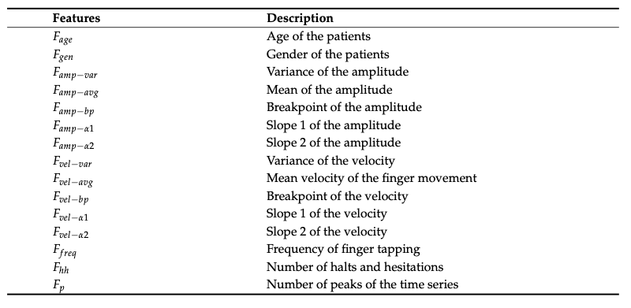
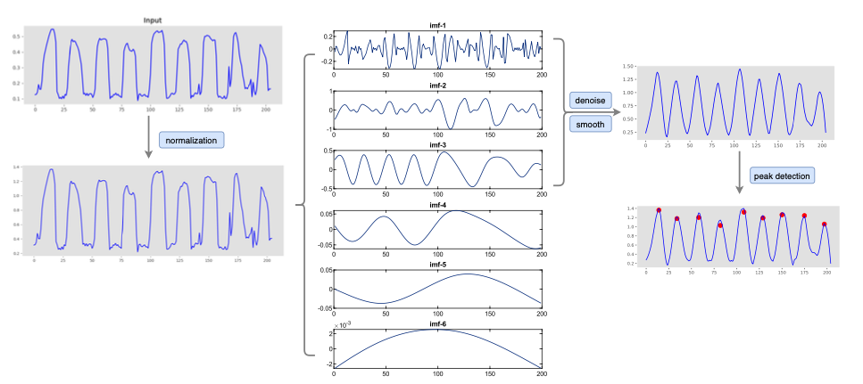

```{r setup, include=FALSE}
knitr::opts_chunk$set(echo = TRUE)
```

# Objective Assessment of the Finger Tapping Task in Parkinson’s Disease and Control Subjects using Azure Kinect and Machine Learning

- sistem za objektivno karaketrizacijo Finger Tapping-a(FT) iz RGB-globinskih video posnetkov,
- inovativni pristop za 3D-sledenje rok (tj. algoritem GMH-D in metode strojnega učenja),
- 60(od tega 27 žensk) zdravih primerov(kontrolna skupina) in 35 pacientov(od tega 15 žensk) s Parkinsonovo boleznijo, skupno 95,
- izvedena je bila ena sama pridobitev podatkov za vsakega posameznika,
- kontrolna skupina je nalogo izvedla samo z dominanto roko; nasprotno pa so morali pcienti s Parkinsonovo boleznijo nalogo opraviti dvakrat – z desno in z levo roko(primeri v študiji so bili neodvisni).
 

## Algoritem GMH-D 
 
- ocene globine, ki jo zagotavlja kamera Azure Kinect in Google Mediapipe Hands,
- algoritem se lahko uporablja za izločanje  značilk, ki omogočajo karakterizacijo FT pri različnih hitrostih in spremenjeni amplitudi.
 

## FT je posnet 
 
- 10s posnetki,
- postenki se pridobivajo preko prilagojene implementacije GMH-D, razvite v okolju Unity(Unity Technologies, San Francisco, CA, ZDA),
- video posnetki se obdelujejo v realnem času(30 frame per seconds), s programsko opremo za pridobivanje podatkov, ki v izhodnem formatu ustvari JSON datoteko, ki vsebuje poti 21 virtualnih sklepov roke(containing the trajectories of 21 virtual hand joints).
 

## Offline data processing 
 
1. računanje razdalje med sklepom konice kazalca (IFT) in sklepom konice palca (TT) ter jo nato segmentirajo, da so posamična gibanja FT identificirana,
2. niz značilk, ki opisujejo povprečne lastnosti gibanja FT in njihovo vrednost skozi celotno nalogo, izraženih s pomočjo koeficienta variacije in spektralnih lastnosti,
3. izbira optimalnega niza značilk za ločitev pacientov s PB od zdravih.
 

## Data Pre-processing and Feature Extraction 
 
- Vsi podatki so bili pred obdelavo značilk predhodno obdelani,
- predobdelava je bila izvedena na 3D joint trajectories in vključevala postopek ponovnega vzorčenja in filtriranja,
- vsi signali so bili ponovno vzorčeni pri 50 fps, da se odstranijo nenatančnosti v frekvenci in poveča gladkost signala,
- a zmanjšanje visokofrekvenčnega šuma so uporabili low-pass, zero-phase Butterworth order 3 filter (10 Hz cut-off frequency),
- dejansko je bila v analizi obdržana le relevantna frekvenčna pasova človeških gibanj.
 

- Pridobljeni signal, ki verjetno približno posnema periodični sinusoidalni signal v zdravem stanju, se samodejno segmentira za identifikacijo posameznih gibanj FT. 
- Segmentacija se izvede z iskanjem maksimalnih in minimalnih točk na signalu s pomočjo ustreznega praga. 
- Točke so nato mapirane na trenutke ZAČETEK, ZAPRTJE(med tapkanjem s prsti) in KONEC posameznih gibanj. Nato se iz obeh posameznih segmentov in celotnega signala razdalje IFT-TT naredijo značilke.
 

## Feature inspection, selection and automatic classification 
 
- Izračunane značilke so bile najprej pregledane s pomočjo statističnega testiranja, da se ocenijo njihove porazdelitve v dveh skupinah,
- normalnost značilk preučena z uporabo Shapiro-Wilkovega testa: vse značilke imele nenormalno porazdelitev, zagotavlja
- izbrana neparametrična metoda, ki je vključevala Mann-Whitneyjev U-test za neodvisne vzorce, za identifikacijo značilk, ki so se različno porazdelile med skupinama PD in HC.
- izračunana tudi Spearmanova korelacija za oceno stopnje linearne odvisnosti med uporabljenimi značilkami in oznako skupine (bodisi PD bodisi HC).
 

Izbor  značilk je bil izveden s pomočjo algoritma Speeded Up Robust Features (SURF), pri čemer so bile izbrane le tiste  značilk, ki so imele pozitiven rezultat. Ta zmanjšana izbira značilk je bila uporabljena za klasifikacijo. \\
Primerjava in ocena klasifikacijskih modelov se izvaja z uporabo postopka Leave-One-Subject-Out (LOSO), da se zmanjša morebitni vpliv prenaučenja modela med testiranjem.

Implementirani štirje nadzorovani modeli v Pythonu:
 
- Support Vector Machine (SVM), 
- K-Nearest Neighbour (KNN), 
- Random Forest (RF) in 
- Extreme Gradient Boosting (XGBoost)
 

Metrike ocenjevanja modelov: Accuracy, Precision, Recall in F1-score, so bile ocenjene na rezultatih, pridobljenih z vsemi modeli.

Optimalni hiperparametri za klasifikacijske modele so bili določeni z uporabo k-kratne križne validacije (CV) (k = 3), v kombinaciji z metodo iskanja Grid search, pri čemer so bili uporabljeni le podatki za učenje, da bi dodatno zagotovili robustnost naučenih klasifikatorjev.

## Rezultati 
Vsi klasifikatorji dosegajo skupno natančnost (Accuracy) nad 90 \%, kar kaže na zelo dobro klasifikacijsko uspešnost. Ustrezno je F1-score več kot 90 \%. Torej so modeli robustni proti tako lažnim pozitivnim kot lažnim negativnim rezultatom, kar nakazuje, da so uporabljene značilke zelo napovedne za PB. Najbolje delujoči model je KNN (K=3, p=2 – torej Evklidska razdalja). Ta rezultat je verjetno povezan z dejstvom, da je algoritem SURF, uporabljen v fazi izbire značilk, temelji na konceptu najbližjih sosedov; zato lahko predpostavimo, da je dobljeni množica najboljših značilk izjemno natančna v kombinaciji s takim modelom.


# An automatic evaluation method for Parkinson's dyskinesia using finger tapping video for small samples 

Tako kot je delal Matjaž.

# Characterizing Disease Progression in Parkinson’s Disease from Videos of the Finger Tapping Test 
 
S pomočjo izračunanih značilk so preverjali hipotezo z dvema različnima pristopoma. Najprej preizkusili tri pristope klasifikacije za napovedovanje resnosti bolezni:
 
- večrazredni klasifikacijski model(multiclass classification model), ki uporablja enoten nabor značilk za vse stopnje,
- ordinalni binarni klasifikacijski pristop(an ordinal binary classification), ki odraža ordinalno naravo ocen resnosti bolezni
- nov slojni binarni klasifikacijski pristop(a novel tiered binary classification), ki uporablja različne značilke gibanja glede na resnost bolezni.

Drugič, izvedli smo statistične analize, da bi ugotovili, katere izračunane značilke se razlikujejo med zdravimi kontrolami in osebami s Parkinsonovo boleznijo (PD) ter kako se te  značilk spreminjajo glede na resnost bolezni.

## Metode

### Zajem podatkov

- 24 zdravih oseb, 66 oseb s Parkinsonovo boleznijo,
- 180 posnetkov in sicer 44 zdravih oseb ter 123 oseb s Parkinsonovo,
- udeleženci s Parkinsonovo boleznijo (PD) z diagnozo, ki je bila postavljena pred manj kot 5 leti in potrjena s strani specialista,
- sodelovali v dveh sejah zajema podatkov, seje zajema podatkov so bile izvedene v stanju brez zdravil,
- videoposnetki pa so bili posneti z uporabo standardne video kamere, nameščene na stojalu,
- Standardni RGB videoposnetki so bili posneti pri 30 fps z ločljivostjo 1920 x 1080 pikslov,
- shranjeni na lokalnem strežniku in kasneje dostopani za obdelavo,
- specialist stal pred udeležencem in dal jasna navodila o tem, kako naj izvede vsak nalogo,
- ročno ocenjeno s pomočjo lestvice resnosti od 0 do 4, kjer 0 pomeni normalen gib, ocene od 1 do 4 pa označujejo rahlo, blago, zmerno in hudo resnost motoričnih simptomov.

### Obdelava videoposnetkov

- Videoposnetki bili ročno obdelani,
- algoritm za oceno drže rok in sledenje brez markerjev, ki ga ponuja MediaPipe

Z uporabo mejnih točk so izračunali kotno razdaljo med palcem in kazalcem tako, da so izračunali kot med dvema vektorjema, ki sta nastala z povezovanjem konic prstov z osnovo roke.

{width=50%} 

### Računanje značilk(_Extraction of Kinematic Features_)

- izračunali povprečje in koeficient variacije (CV) amplitude gibanja,
- povprečje in CV hitrosti gibanja (amplituda gibanja / trajanje gibanja),
- povprečje in CV hitrosti gibanja pri odpiranju (amplituda gibanja / trajanje gibanja pri odpiranju), 
- povprečje in CV hitrosti gibanja pri zapiranju (amplituda gibanja / trajanje gibanja pri zapiranju), 
- povprečje, CV in razpon trajanja cikla, 
- hitrost gibanja (število pritiskov na čas) ter 
- upad amplitude (povprečna amplituda v prvi polovici poskusa v primerjavi s povprečno amplitudo v drugi polovici poskusa).

## Modeling

1. Multiclass Classification

V tem pristopu je usposobljen en sam večrazredni klasifikacijski model za razvrščanje vseh resnosti motoričnih simptomov na podlagi kinematičnih  značilk, pridobljenih iz videoposnetkov. To pomeni, da izhod modela predstavlja verjetnost, da bo videoposnetek testa pritiska s prsti dodeljen oceni resnosti 0, 1, 2 ali 3.

2. Ordinal Binary Classification

Ta pristop je prvotno uvedel Morinan et al.(_Computer vision quantification of whole-body Parkinsonian bradykinesia using a large multi-site population_). V tem pristopu je usposobljenih več binarnih klasifikacijskih modelov za prepoznavanje resnosti motoričnih simptomov na podlagi kinematičnih  značilk, pridobljenih iz videoposnetkov. 

Skupaj so trije binarni klasifikacijski modeli. Prvi model razvršča videoposnetke z oceno 0 proti ocenam 1, 2 ali 3; drugi model razvršča videoposnetke z ocenama 0 ali 1 proti ocenama 2 ali 3; in tretji model razvršča videoposnetke z ocenami 0, 1 ali 2 proti oceni 3.

3. Tiered Binary Classification

V tem pristopu je usposobljenih več binarnih klasifikacijskih modelov. 

Skupaj so trije binarni klasifikacijski modeli, pri čemer je vsak model zasnovan za prepoznavanje različnih stopenj resnosti bolezni. Prvi model razvršča zdrave kontrole od oseb s Parkinsonovo boleznijo (PD). Če prvi model pokaže, da videoposnetek pripada osebi s PD, drugi model razvršča ocene 1 proti ocenam 2 ali 3. Na koncu, če drugi model pokaže, da bi moral videoposnetek prejeti oceno višjo od 1, tretji model razvršča ocene 2 proti oceni 3.

- modela logistične regresije,
- vsi modeli so vključevali kinematične značilke, pridobljene iz videoposnetkov, ki so bile opisane zgoraj, skupaj z udeleženčevo starostjo in spolom kot značilnostmi za klasifikacijo,
- značilke normalizirane,
- podatki so bili razdeljeni na učne(70 \%) in testne(30\%),
- petkratna križna validacija, pri čemer uporabljeni le učni podatki,
- modeli so bili primerjani na podlagi površine pod krivuljo (AUC) krivulje ponovitve-preciznosti(_Recall-Precision curve_) in F1.

Za zmanjšanje tveganje za prekomerno prilagoditev (overfitting), smo uporabili metodo rekurzivne odstranitve  značilk (RFE) - sistematično odstrani najmanj vplivne  značilk, tiste z minimalnim vplivom na koeficiente modela. Po odstranitvi ne-vplivne znčilke je bil model ponovno usposobljen z preostalimi značilkami. Ta iterativni postopek se ponovi, dokler nadaljnje zmanjšanje  značilk ne prinese izboljšanja v zmogljivosti modela.

Ker so naši podatki neuravnoteženi, smo uporabili algoritem Synthetic Minority Oversampling Technique (SMOTE) za povečanje manj zastopanih razredov in zmanjšanje prekomerno zastopanih razredov v naših podatkih, da bi ustvarili podatkovne sklope z uravnoteženimi razredi.

Na koncu smo izvedli statistične teste, da bi ugotovili, ali so se kinematične  značilk gibanja statistično pomembno razlikovale med ocenami, dodeljenimi s strani specialistov (0, 1, 2, 3 in 4). Razlike med skupinami smo ocenili z uporabo ANOVA za podatke, ki so normalno porazdeljeni, in Welch ANOVA za podatke, ki niso normalno porazdeljeni. Za oceno normalnosti naših podatkov smo uporabili enovzorečni Kolmogorov-Smirnov test. Za skupine, ki so pokazale statistično pomembne razlike, smo izvedli post-hoc test Tukey’s Honest Significant Difference z Bonferroni korekcijo, da bi ugotovili, katere skupine se med seboj statistično pomembno razlikujejo. P-vrednost < 0,05 smo šteli za statistično pomembno razliko.

## Rezultati

### Multiclass Classification

Postopek izbire značilk je identificiral šest ključnih  značilk, ki so bile ključne za klasifikacijo

- Povprečno amplitudo, 
- Povprečno hitrost, 
- Povprečno hitrost odpiranja, 
- Povprečno hitrost zapiranja, 
- Povprečno trajanje cikla in 
- Koeficient variacije trajanja cikla. 

Z uporabo teh šestih značilk je model izkazal povprečno AUC krivulje ponovitve-preciznosti 0,39 in povprečno F1-oceno 0,42. Natančnost modela je bila 30\% za oceno 0, 67\% za oceno 1, 21\% za oceno 2 in 59\% za oceno 3.

### Ordinal Binary Classification

**i) Ocena [0] proti ocenam [1, 2, 3]:**

Postopek izbire značilk je identificiral tri ključne značilke, ki so bile kritične za klasifikacijo

- Povprečno hitrost, 
- Povprečno hitrost odpiranja in 
- Povprečno hitrost zapiranja. 

Z uporabo teh treh značilk je model dosegel AUC krivulje ponovitve-preciznosti 0,94 in F1-oceno 0,87. Natančnost modela je bila 69\% za oceno 0 in 86\% za ocene od 1 do 3.

**ii) Ocena [0, 1] proti ocenama [2, 3]:**

Postopek izbire značilk je identificiral pet ključnih  značilk, ki so bile kritične za klasifikacijo

- Povprečna amplituda, 
- Povprečna hitrost odpiranja, 
- CV hitrost zapiranja, 
- Povprečno trajanje cikla in 
- CV trajanja cikla. 

Z uporabo teh petih značilk je model dosegel AUC krivulje ponovitve-preciznosti 0,85 in F1-oceno 0,84. Natančnost modela je bila 60\% za oceno 1 ali 2 in 89\% za oceno 2 ali 3.

**iii) Ocena [0, 1] proti ocenama [2, 3]:**

Postopek izbire značilk je identificiral pet ključnih  značilk, ki so bile kritične za klasifikacijo

- Povprečna amplituda, 
- Povprečna hitrost odpiranja, 
- CV hitrost zapiranja, 
- Povprečno trajanje cikla in 
- CV trajanja cikla. 

Z uporabo teh petih značilk je model dosegel AUC krivulje ponovitve-preciznosti 0,85 in F1-oceno 0,84. Natančnost modela je bila 60\% za oceno 1 ali 2 in 89\% za oceno 2 ali 3.

### Tiered Binary Classification

**i) Zdravi proti bolnim**

Postopek izbire značilk je identificiral pet ključnih  značilk, ki so bile kritične za klasifikacijo

- Povprečna hitrost, 
- Povprečna hitrost zapiranja, 
- Povprečno trajanje cikla, 
- Amplitudni upad in 
- starost. 

Z uporabo teh petih značilk je model dosegel AUC krivulje ponovitve-preciznosti 0,97 in F1-oceno 0,91. Natančnost modela je bila 85\% za zdrave kontrolne osebe (HC) in 88\% za osebe s Parkinsonovo boleznijo (PD).

**ii) Ocena [1] proti ocenama [2, 3]:**

Postopek izbire  značilk je identificiral šest ključnih  značilk, ki so bile kritične za klasifikacijo

- Povprečna amplituda, 
- Povprečna hitrost, 
- Povprečna hitrost odpiranja, 
- CV hitrost zapiranja, 
- Amplitudni upad in 
- CV trajanja cikla. 

Z uporabo teh šestih značilk je model dosegel AUC krivulje ponovitve-preciznosti 0,97 in F1-oceno 0,88. Natančnost modela je bila 100\% za oceno 1 in 77\% za ocene 2 in 3.

**iii) Ocena [2] proti oceni [3]:**

Postopek izbire  značilk je identificiral štiri ključne  značilk, ki so bile kritične za klasifikacijo
- CV hitrost odpiranja, 
- Razpon trajanja cikla, 
- Amplitudni upad in 
- starost. 

Z uporabo teh štirih značilk je model dosegel AUC krivulje ponovitve-preciznosti 0,89 in F1-oceno 0,81. Natančnost modela je bila 84\% za oceno 2 in 80\% za oceno 3.

## Ugotovitve

Tako kot prejšnje študije, tudi naša metoda kvantificira tradicionalne kinematične značilnosti, kot so amplituda gibanja(movement amplitude), hitrost(speed) in upad amplitude(amplitude decay), ki linearno variirajo s težo motoričnih simptomov(which vary linearly with motor symptom severity. Poleg tega smo kvantificirali netradicionalne kinematične značilnosti, vključno s trajanjem cikla(cycle duration), hitrostjo odpiranja in zapiranja(opening and closing speeds) ter variabilnost(variability measures).

Drugi prispevek te študije vključuje uvedbo nove metode razvrščanja v več stopnjah. Metoda razvrščanja v več stopnjah odraža klinično prakso ocenjevanja pacientov, kjer se zdravniki osredotočajo na različne motorične vidike za dodeljevanje višjih ocen. Poleg tega je naš pristop pokazal boljšo natančnost pri napovedovanju resnosti bolezni in ločevanju med različnimi stopnjami resnosti v primerjavi z obstoječimi metodami.

# Detection of Parkinson disease using multiclass machine learning approach

## Podatki

Nabor podatkov zajema 195 glasovnih posnetkov od 147 pacientov s Parkinsonovo boleznijo in 48 zdravih kontrol.

Nabor podatkov obsega 195 glasovnih posnetkov, pri čemer je bil vsak posnet za 36 sekund v zvočno izolirani kabini. Posnetki so bili pridobljeni s pomočjo umerjenega mikrofona, nameščenega 8 cm od ust posameznika. Vsak posnetek je opisan s 24 biomedicinskimi glasovnimi meritvami.

Starost udeležencev s Parkinsonovo boleznijo je bila med 46 in 85 leti (povprečje: 65,8, standardni odklon: 9,8), diagnoze pa so trajale od 0 do 28 let. 

Posnetki so bili pretvorjeni v strukturirano obliko CSV, ki zajema različne vokalne značilnosti, kot so višina tona, jitter, shimmer in razmerje med harmoniki in šumom.

## Metodologija

### Preobdelava podatkov

Za obravnavo morebitnih neravnovesij razredov se uporablja tehnika sintetičnega nadvzorčenja manjšinskih primerov (SMOTE, _Synthetic Minority Over-sampling Technique_), ki poveča število primerov manjšinskega razreda in zagotovi uravnoteženo porazdelitev nabora podatkov.

Manjkajoče vrednosti lahko pomembno vplivajo na delovanje modela, če niso pravilno obravnavane. Za to smo uporabili kombinacijo strategij dopolnjevanja vrednosti, ki temelji na naravi in porazdelitvi manjkajočih podatkov. Za numerične značilke smo uporabili dopolnjevanje z aritmetično sredino, pri čemer smo manjkajoče vrednosti nadomestili z povprečno vrednostjo ustrezne značilnosti - nadomeščanje z aritmetično sredino pomaga ohraniti splošno porazdelitev podatkov. Nasprotno pa smo za kategorialne značilke uporabili dopolnjevanje z modusom, kjer smo manjkajoče vrednosti nadomestili z najpogostejšo kategorijo - ohraniti celovitost kategorialnih spremenljivk.

Po postopku dopolnjevanja smo opazili, da nabor podatkov kaže neravnovesje, saj vsebuje 147 primerov Parkinsonove bolezni (PB) in 48 zdravih kontrol (ZK), kar predstavlja 75 % in 25 % nabora podatkov.

Nabor podatkov razdelili v razmerju 80 % za usposabljanje in 20 % za testiranje in validacijo.

Poleg tega smo vsako značilko posebej standardizirali z uporabo StandardScaler - ta korak zagotavlja, da vse značilnosti prispevajo enako k modelu in prepreči, da bi značilke z večjimi magnitudami prevladovale pri učenju modela.

### Izbira značilk

Uporabili smo rekurzivno eliminacijo značilnosti (RFE, _Recursive Feature Elimination_) za prepoznavanje najpomembnejših vokalnih značilnosti za klasifikacijo Parkinsonove bolezni. RFE iterativno odstranjuje najmanj pomembne značilnosti na podlagi uspešnosti modela SV), na koncu pa izbere podmnožico značilnosti, ki najbolj prispevajo k nalogi klasifikacije.

SelectKBest - algoritem je imel ključno vlogo pri optimizaciji našega nabora podatkov z natančnim izborom osmih najbolj informativnih značilk. Specifične značilke, ki jih je izbral SelectKBest, so bile določene na podlagi njihove posamezne prisotnosti pri napovedovanju naloge. Značilke, ki so pokazale najvišje _k-scor-je_, so bile prednostno vključene v končni nabor podatkov, medtem ko so bile manj informativne značilke izključene. 

Izključitev določenih značilk je motila občutljivo ravnovesje in sinergijo med njimi, kar je povzročilo poslabšanje uspešnosti modela. Zavedajoč se tega ključnega spoznanja smo sprejeli premišljeno in informirano odločitev, da se izognemo izbiri značilk in namesto tega uporabimo vse razpoložljive značilke v naših modelih.

### Razvoj modela

Algoritem _RandomizedSearchCV_ sistematično optimizira hiperparametre izbranih modelov:

- K-najbližjih sosedov (KNN), 
- podpornih vektorskih modelov (SVM),
- Kernel Support Vector Machine(KSVM),
- naključni gozd (RF),
- odločilno drevo (DT) in 
- povratne nevronske mreže (FNN). 


Razvili smo dva glavna modela: model K-najbližjih sosedov (KNN) in povratno nevronsko mrežo (FNN). Arhitekturo in parametre mreže FNN smo optimizirali z uporabo algoritma RandomizedSearchCV.

### Prilagajanje hiperparametrov

Za oba modela smo izvedli prilagajanje hiperparametrov z uporabo algoritma RandomizedSearchCV, ki naključno vzorči širok spekter kombinacij parametrov, da bi našel optimalne nastavitve, ki maksimirajo delovanje modela.

Evalvacijske metrike, kot so natančnost, preciznost, priklic in F1-ocena, se dosledno uporabljajo za ocenjevanje uspešnosti posameznih modelov. Z gradnjo ansambla, ki združuje napovedi več modelov, metoda ansambla izkorišča prednosti vsakega sestavnega modela za izboljšanje celotne natančnosti klasifikacije PB, kar predstavlja obetaven pristop za učinkovitejšo diagnozo in zdravljenje pacientov.

## Rezultati

### No RandomizedSearch and feature selection 

Kernel Support Vector Machine (KSVM) doseže natančnost 81,61 %, kar kaže na njegovo splošno pravilnost pri napovedovanju primerov PB. Z vrednostjo 79,81 % za priklic (recall) KSVM izkazuje učinkovitost pri prepoznavanju velikega deleža dejanskih pozitivnih primerov. Poleg tega njegova visoka natančnost 97,16 % pomeni nizko stopnjo lažno pozitivnih primerov, kar izkazuje njegovo natančnost pri pozitivnih napovedih. F1 točka, ki je uravnotežena meritev natančnosti in priklica, znaša 88,27 %, kar poudarja uravnoteženo delovanje modela.

Model Random Forest (RF) doseže najvišjo natančnost med vsemi modeli z impresivnimi 86,89 %, kar kaže na njegovo sposobnost pravilnega razvrščanja tako primerov PB kot tudi zdravih oseb. Izstopa tudi v priklicu s 89,11 %, kar kaže na njegovo sposobnost zajemanja velikega deleža dejanskih primerov PB. Vendar pa F1 točka 84,18 % kaže na rahlo ravnotežje med natančnostjo in priklicem.

Model Decision Tree (DT) prikazuje uravnoteženo uspešnost v vseh metrikah, saj doseže natančnost 77,08 %. DT kaže priklic 78,1 %, kar poudarja njegovo sposobnost prepoznavanja pomembnega deleža dejanskih primerov PB, medtem ko natančnost 91,11 % kaže na visoko natančnost pri pozitivnih napovedih. F1 točka 85,08 % poudarja uravnoteženost med natančnostjo in priklicem.

Model K-Nearest Neighbor (KNN) izkazuje dobro natančnost 82,21 %, s priklicem 78,09 %, kar kaže na njegovo učinkovitost pri zajemanju pravih pozitivnih primerov. Poleg tega se KNN ponaša z visoko natančnostjo 97,45 %, kar pomeni nizko stopnjo lažno pozitivnih primerov. F1 točka 87,17 % potrjuje uravnoteženo delovanje modela.

Končno, Feed-forward Neural Network (FNN) doseže najvišjo natančnost med modeli s 88,19 %, kar odraža splošno pravilnost napovedi. S priklicem 87,25 % FNN izstopa pri prepoznavanju dejanskih primerov PB. Njegova natančnost 98,12 % pomeni zelo nizko stopnjo lažno pozitivnih napovedi, kar prinaša visoko natančnost pri pozitivnih napovedih. F1 točka 92,13 % potrjuje uravnoteženo in robustno delovanje modela v vseh metrikah, kar ga postavlja kot obetaven model za odkrivanje PB.

### RandomizedSearch in feature selection

Kernelska podporna vektorska naprava (KSVM) prikazuje solidno zmogljivost z natančnostjo 85,91 %, kar nakazuje na njeno splošno pravilnost pri napovedovanju primerov PB. Izstopa z poklicnim zaznavanjem 87,91 %, kar pomeni, da je sposobna zajeti visok odstotek resničnih pozitivnih primerov. Natančnost 93,55 % kaže nizko stopnjo lažno pozitivnih napovedi, kar prispeva k natančnosti modela pri pozitivnih napovedih. Poleg tega F1-ocena 90,17 % poudarja uravnotežen kompromis med natančnostjo in poklicnim zaznavanjem, kar prikazuje robustno zmogljivost modela.

Model Random Forest (RF) presega druge modele po natančnosti z impresivnimi 89,61 %, kar poudarja njegovo učinkovitost pri pravilnem razvrščanju primerov PB in ne-PB. Izstopa z poklicnim zaznavanjem 92,18 %, kar nakazuje na njegovo sposobnost zajeti visok odstotek resničnih pozitivnih primerov. Poleg tega natančnost 96,07 % pomeni nizko stopnjo lažno pozitivnih napovedi, kar prispeva k natančnosti modela pri pozitivnih napovedih. F1-ocena 93,72 % nakazuje harmonično ravnovesje med natančnostjo in poklicnim zaznavanjem.

Model drevesa odločitev (DT) prikazuje uravnotežene metrike zmogljivosti z natančnostjo 86,12 %. Izkazuje poklicno zaznavanje 86,11 %, kar pomeni njegovo učinkovitost pri prepoznavanju znatnega dela dejanskih primerov PB. Natančnost 96,22 % poudarja njegovo pravilnost pri pozitivnih napovedih, kar vodi v uravnoteženo F1-oceno 91,17 %.

Model K-Nearest Neighbor (KNN) prikazuje pohvalno natančnost 89,19 %, z poklicnim zaznavanjem 89,12 %, kar pomeni njegovo učinkovitost pri zajemanju resničnih pozitivnih primerov. Natančnost 98,16 % pomeni nizko stopnjo lažno pozitivnih napovedi. F1-ocena 93,18 % poudarja uravnoteženo zmogljivost glede na natančnost in poklicno zaznavanje.

Zadnji model, Feed-forward Neural Network (FNN), prikazuje najvišjo natančnost med modeli z 92,12 %, kar odraža splošno pravilnost napovedi. Z poklicnim zaznavanjem 94,17 % FNN izstopa pri prepoznavanju dejanskih primerov PB. Natančnost 96,98 % pomeni nizko stopnjo lažno pozitivnih napovedi, kar prispeva k visoki natančnosti pri pozitivnih napovedih. F1-ocena 96,11 % dokazuje uravnoteženo in robustno zmogljivost modela na več metričnih področjih, kar FNN postavlja kot obetaven model za odkrivanje Parkinsonove bolezni.

### RandomizedSearch

Kernelska podporna vektorska naprava (KSVM) doseže izjemno natančnost 95,89 %, kar prikazuje njeno splošno pravilnost pri napovedovanju primerov PB. Z poklicnim zaznavanjem 96,88 % KSVM izstopa pri zajemanju visokega odstotka resničnih pozitivnih primerov, medtem ko natančnost 98,71 % pomeni visoko natančnost pri pozitivnih napovedih. F1-ocena 97,62 % poudarja harmonično ravnovesje med natančnostjo in poklicnim zaznavanjem, kar izpostavlja robustnost modela.

Model Random Forest (RF) doseže pohvalno natančnost 93,12 %, kar kaže na njegovo sposobnost pravilnega razvrščanja primerov PB in ne-PB. Izstopa z poklicnim zaznavanjem 93,15 %, kar kaže, da je zmožen zajeti visok odstotek resničnih pozitivnih primerov. Poleg tega natančnost 98,46 % pomeni nizko stopnjo lažno pozitivnih napovedi, kar prispeva k natančnosti modela pri pozitivnih napovedih. F1-ocena 96,15 % nakazuje harmonično ravnovesje med natančnostjo in poklicnim zaznavanjem, kar poudarja učinkovitost modela.

Model drevesa odločitev (DT) prikazuje solidne zmogljivosti z natančnostjo 91,15 %. Izkazuje poklicno zaznavanje 93,33 %, kar pomeni njegovo učinkovitost pri prepoznavanju znatnega dela dejanskih primerov PB. Natančnost 96,56 % poudarja pravilnost modela pri pozitivnih napovedih, kar vodi do uravnotežene F1-ocene 95,11 %.

Model K-Nearest Neighbor (KNN) doseže pohvalno natančnost 90,11 %, z poklicnim zaznavanjem 89,21 %, kar pomeni njegovo učinkovitost pri zajemanju resničnih pozitivnih primerov. Natančnost 98,16 % pomeni nizko stopnjo lažno pozitivnih napovedi, kar prispeva k natančnosti pri pozitivnih napovedih. F1-ocena 93,56 % poudarja uravnoteženo zmogljivost modela na metričnih področjih natančnosti in poklicnega zaznavanja.

Zadnji model, Feed-forward Neural Network (FNN), doseže izjemno natančnost 99,11 %, kar odraža splošno pravilnost pri napovedih. Z poklicnim zaznavanjem 98,78 % FNN izstopa pri prepoznavanju dejanskih primerov PB. Natančnost 99,96 % pomeni nizko stopnjo lažno pozitivnih napovedi, kar prispeva k visoki natančnosti pri pozitivnih napovedih. F1-ocena 99,23 % dokazuje uravnoteženo in robustno zmogljivost modela na več metričnih področjih, zaradi česar je FNN zelo obetaven model za odkrivanje Parkinsonove bolezni.

### Drugi avtorji

John Michael Templeton se je osredotočil na klasifikacijo z drevesom odločitev na podlagi podatkov senzorjev in dosegel natančnost 85,72%. Gunjan Pahuja je raziskoval učinkovitost MLP, SVM in KNN, pri čemer je dosegel impresivno natančnost 95,89%. Aditi Govindu je uporabila SVM, RF in KNN, dosegle pa so natančnost 91,83%. Farhad Abedinzadeh Torghabeh je preučil AdaBoost in KNN, pri čemer je dosegel visoko natančnost 98,62%. Khaled M je uporabil tehniki SMOTE in PCA, kar je privedlo do natančnosti 97,11%. Maitane Martinez je izvedla SVM in MLP, pri čemer je dosegla natančnost 84,41%. Ahmed M je osredotočil svojo raziskavo na SVM in dosegel natančnost 92,31%. Bruno Fonseca je raziskoval SVM, RF in KNN z natančnostjo 89,56%. Arti Rana je raziskovala umetne nevronske mreže (ANN) in dosegla natančnost 96,71%. Poleg tega je predlagani model, ki vključuje RandomizedSearchCV in FNN, pokazal najboljše rezultate z natančnostjo 99,11%.

# Early detection of Parkinson’s disease using machine learning

V tem članku opisujemo in preizkušamo nov pristop k računalniškemu vidu videoposnetkov testa tapkanja s prsti. Konkretno, uporabimo globoko nevronsko mrežo neposredno na videoposnetku tapkanja s prsti. Preizkušamo sposobnost te mreže, da loči tapkanje s prsti pri Parkinsonovi bolezni od tapkanja pri kontrolnih udeležencih. Poleg tega uporabimo class activation maps za vizualizacijo najpomembnejših prostorskih in časovnih območij videoposnetka tapkanja, na katere se mreža ‘osredotoči’, da loči Parkinsonovo bolezen od kontrolne skupine.

## Metode

### Podatki

Skupaj je bilo zbranih 152 videoposnetkov tapkanja s prsti od 77 udeležencev, ki so vključevali 40 oseb z Parkinsonovo boleznijo (PwP) in 37 zdravih kontrolnih udeležencev. Leva in desna roka vsakega udeleženca sta bili posneti ločeno, pri čemer sta bila dva videoposnetka zavrnjena, ker je roka zapustila okvir kamere.

Vse osebe z Parkinsonovo boleznijo (PwP) so bile predhodno diagnosticirane pri nevrologu, specialistu za gibalne motnje, ob času snemanja videoposnetkov so bile subjektivno in objektivno v stanju po svojem rednem režimu jemanja zdravil.

Kontrolni udeleženci niso imeli zgodovine Parkinsonove bolezni ali druge nevrološke diagnoze.

V videoposnetku sta bila vidna samo roka in podlaket. Razdalja med kamero in roko je bila približno 1 m, vendar ni bila natančno določena. Palec in kazalec (prsta 1 in 2) sta bila najbližje kameri. Udeleženci niso dobili posebnih navodil glede upogiba ali iztega prstov 3 do 5, temveč so jih lahko postavili po svoji izbiri, čeprav je raziskovalec dal kratko demonstracijo, pri kateri so bili ti prsti iztegnjeni.

Za snemanje standardnega videoposnetka je bil uporabljen pametni telefon, nameščen na stojalu ob strani udeleženca, le z ambientalno osvetlitvijo (ločljivost 1920x1080 slikovnih pik, 60fps). Udeležence so prosili, naj tapkajo s kazalcem in palcem skupaj “čim hitreje in čim širše” vsaj 10 sekund. Vsak videoposnetek je bil urejen v posnetek dolžine 11 sekund: 1 sekundo pred začetkom tapkanja in 10 sekund tapkanja.

### Preobdelava

Za enotno velikost videoposnetkov je bil obrezan videoposnetek zmanjšan na 80x60 slikovnih pik z Gaussovim glajenjem in bikubično interpolacijo (pri ohranjanju 60fps) z uporabo knjižnice OpenCV, pred pretvorbo v sivinsko barvo.

Videoposnetki so bili razdeljeni na 1-sekundne izrezke, ki so se med seboj prekrivali za 0,5 sekunde, tako da so bili izrezki od 0 do 1 sekunde, 0,5–1,5 sekunde, 1–2 sekunde itd. Ta postopek je prinesel skupno 3148 izrezkov (1637 pacientov in 1511 kontrolnih), vsak dolžine 60fps in velikosti 80x60 slikovnih pik. Ti izrezki so predstavljali vizualne podatke za usposabljanje in ocenjevanje modela.

Preden so bili podatki posredovani nevronski mreži, so bili podatki za usposabljanje centrirani na povprečje in deljeni z vsesplošno standardno deviacijo vrednosti slikovnih pik (tj. Z-score normalization). Preskusni podatki so bili normalizirani z uporabo povprečja in standardne deviacije podatkov za usposabljanje.

### Izdelava modela

Ker so videoposnetki shranjeni kot 3-tensor  s dimenzijami 60x80x60, je naš model nevronska mreža, ki temelji predvsem na 3D konvolucijskih filtrih. Model vključuje tri plasti konvolucij in max-pooling, pri čemer je med konvolucijami in max-pooling operations uporabljena normalizacija po sklopih za izboljšanje stopnje konvergence.

Parametri v 3D konvolucijah in gostih plasteh so imeli L2 (tj. Ridge) regularizacijo za preprečevanje prenaučenosti, poleg tega pa je bila med popolnoma povezano plastjo in izhodno plastjo uporabljena plast za izločanje (10% dropout). Skupno ima ta model 20 milijonov učljivih parametrov. 

Model je bil zgrajen z uporabo ogrodja Keras in usposobljen z uporabo optimizatorja Adam, ki je bil uporabljen za funkcijo izgube binary cross-entropy loss. Hitrost učenja, število epoch in moč regularizacije so bile izbrane z uporabo grid search, združenega z 6-kratno navzkrižno validacijo, da bi maksimizirali F1-oceno. 

### Učinkovitost nevronske mreže

Natančnost klasifikacije modela je bila ocenjena z uporabo petih metrik: 

- accurancy, 
- precision, 
- priklic (recall), 
- F1-ocena in 
- Area Under the Receiver Operating Characteristic curve (AUROC).

Za pridobitev realističnih ocen učinkovitosti smo uporabili navzkrižno validacijo - model za usposabljanje in testiranje, je bil nato usposobljen na 4 teh sklopih, en sklop uporabljen za validacijo in en za testiranje.

## Rezultati

Z uporabo našega postopka navzkrižne validacije je model dosegel odlično učinkovitost na podatkih za usposabljanje, z nekaterimi dokazi o prenaučenosti (kar je verjetno posledica omejenega števila razpoložljivih podatkov). 

Accurancy na testnih podatkih je bila 0.69, precision 0.73, priklic (recall) 0.76, in AUROC na testu 0.76. Ta model je imel hitrost učenja 7.2e-4, moč regularizacije 0.1, in je tekel 400 epoch.

Naši rezultati kažejo, da se lahko nevronska mreža globokega učenja neposredno uporabi na videoposnetkih tapkanja s prsti, posnetih s pametnim telefonom, brez vnaprej določenih pravil ali meril, za razlikovanje oseb s Parkinsonovo boleznijo od kontrolnih udeležencev.

# Clinically Informed Automated Assessment of Finger Tapping Videos in Parkinson’s Disease

Na začetku je 3D drža roke izvlečena z uporabo najnovejše različice MediaPipe, posodobljene februarja 2023, za generiranje časovnih vrst podatkov o ključnih položajih sklepov.

Surovi podatki časovnih vrst ključnih položajev sklepov so predstavljeni kot $K = \{Kj(t)\}$, kjer $j$ označuje $j$-to ključno točko ($j = 1, 2, \dots, 20)$, $t$ pa pomeni indeks slikovnega okvirja (za $t = 1, 2, \dots, L$).

Izračunali smo časovne vrste razdalje med palcem in kazalcem, označene kot $I$ z dolžino $L$, kar ustreza razdalji med točkama $K_4$ in $K_8$ pri nalogi tapkanja s prsti. V drugi fazi smo izločili 15 specifičnih značilnosti za vsak video. Te značilnosti zajemajo dva demografska elementa in 13 kinematičnih značilnosti, ki so bile pridobljene s procesiranjem signalov časovnih vrst podatkov. Te kinematične značilnosti so skladne s smernicami navodil UPDRS.

{width=50%} 
 
## Time Series Preprocessing

Za vhodne časovne vrste $I$, $p = [p_1, p_2, \dots, p_n, \dots, p_N]$ predstavlja vrhove, kjer je $p_n$ $n$-ti vrh, $A_n$ pa amplituda pripadajočega vrha $p_n$. Glede na model roke, $K_j = (k_{x,j}, k_{y,j}, k_{z,j})$ predstavlja položaj $j$-te ključne točke. Velikost dlani v času $t$ je ocenjena z uporabo $K_0$ in $K_9$ kot:

$$
Palm_t = \sqrt{(k_{x,0} - k_{x,9})^2 + (k_{y,0}- k_{y,9})^2 + (k_{z,0}- k_{z,9})^2} \lvert t.
$$

Nato se izvede normalizacija, da se Palmt prilagodi za primerjavo med posamezniki, kot je prikazano spodaj:

$$
I_{norm} = \frac{I}{Palm_t}
$$


Nato smo uporabili empirično razgradnjo načina(_Empirical Mode Decomposition_ - EMD), da smo $I_norm$ razgradili v serijo intrinzičnih modalnih funkcij(_Intrinsic Mode Functions_ - IMF) in preostalo komponento, kot je prikazano na spodnji sliki. Vsaka IMF zajema poseben nihajni način, za katerega so značilne spremenljive frekvence in amplitude. V našem pristopu smo izbrali prve tri IMF kot glavne komponente signala, s čimer smo dosegli ravnotežje med poenostavitvijo podatkov in ohranjanjem ključnih informacij. Vendar pa lahko signal tudi po razgradnji z EMD vsebuje šum ali nezaželene artefakte, kot so tisti, ki izhajajo iz tresenja prstov. Da bi to odpravili, smo uporabili postopek odstranjevanja šuma in glajenja, da smo odpravili takšne motnje.

Po predobdelavi in čiščenju časovnih vrst podatkov je bil naslednji korak zaznavanje vrhov ali specifičnih dogodkov v signalu. Za iskanje lokalnih maksimumov ali minimumov, ki so služili kot ključne točke v podatkih, smo uporabili modul za zaznavanje vrhov.

{width=50%} 

## Feature Extraction

V naš model smo vključili dva demografska dejavnika: starost in spol. Ta vključitev temelji na opažanju, da lahko starejši posamezniki kažejo znake bradikinezije, povezane s staranjem, neodvisno od Parkinsonove bolezni (PB), ter da lahko tako starost kot spol vplivata na napredovanje PB. 

Na podlagi podatkov časovnih vrst smo izločili 5 značilnosti, povezanih z amplitudo. Izločili smo 5 značilnosti, povezanih z hitrostjo. 

Pri Parkinsonovi bolezni so "zaustavitve ali zadržki" značilni za kratke trenutke zamrznitve ali zakasnitev sposobnosti začetka gibov, ki so pogosto opaženi med ponavljajočimi se dejanji.  Skozi obsežne razprave, da bi pojasnili "zaustavitve" in "zadržke" v naši študiji, smo definirali "zaustavitve" kot trenutke popolne zaustavitve, ki jih zaznamuje ničelna amplituda. Po drugi strani pa je "zadržek" bil opredeljen kot opazno zmanjšanje hitrosti, ki je registrirala vrednosti nad ničlo, vendar precej pod vnaprej določenim empiričnim pragom.

## Machine Learning

Izbrali smo pristop odločilnega drevesa kot glavno metodo klasifikacije, da bi izboljšali razložljivost in kvantifikacijo ocen, prilagojenih našemu specifičnemu nalogu.

Vendar pa smo ugotovili visoko korelacijo le med frekvenco in hitrostjo tapkanja, zato smo se odločili, da ohranimo vseh 15 prvotnih značilnosti v naši analizi. Ta pristop smo izbrali, da zagotovimo ohranitev edinstvenega prispevka vsake značilnosti.

## Eksperiment

- Laboratorij: ločljivost 3840 x 2160 px in hitrost sličic 15/s,
- Ambulanta: ločljivost 1920 x 1080 px in hitrost sličic 60 fps,
- Skupaj 65 pacientov, diagnosticiranih s Parkinsonovo boleznijo,
- 75 videoposnetkov od 50 pacientov ocenjenih kot primernih za oceno učinkovitosti predlagane metode,
- 60 videoposnetkov dodeljenih za učni niz in 15 videoposnetkov za testni niz,
- accuracy, precision, recall, in F1-score.

Najprej je bila izvedena glavna naloga klasifikacije na podlagi značilnosti tapkanja prstov z uporabo kliničnih ocen. Predlagana metoda je dosegla visoko natančnost, z natančnostjo (Accuracy(t1)) 80 \% in natančnostjo (Accuracy(t2)) 93,3 \%. 


